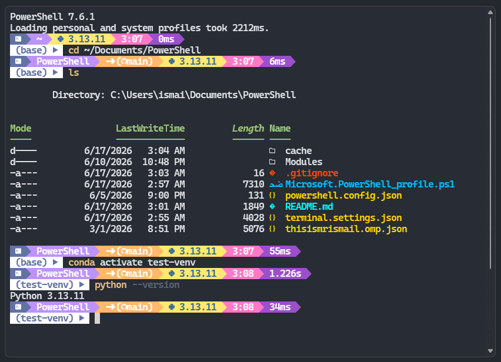

# PowerShell Profile

Personal PowerShell 7 profile with performance caching, a custom Oh My Posh theme, and productivity utilities.

## Preview

## Structure

| Path | Purpose |
|---|---|
| `Microsoft.PowerShell_profile.ps1` | Main profile loaded on every shell start |
| `thisismrismail.omp.json` | Oh My Posh theme |
| `cache/` | Auto-generated init scripts (Conda hook, Posh prompt) |

## Features

### Performance
Conda and Oh My Posh init scripts are cached to disk and only regenerated when the source binary or theme file changes, keeping shell startup fast.

### Modules
- **PSReadLine** — Predictive IntelliSense (history + list view), history search on ↑/↓
- **Terminal-Icons** — File/folder icons in directory listings

### Aliases

| Alias | Command |
|---|---|
| `c` | `clear` |
| `e` | `explorer.exe` |
| `open` | `ii` (Invoke-Item) |
| `ps` | `Get-Process` |
| `kill` | `Stop-Process` |
| `cu` | `cursor` |
| `ngrok` | `%LOCALAPPDATA%\ngrok\ngrok.exe` |
| `agy` / `antigravity` | Antigravity IDE (detached) |

### Functions

| Function | Description |
|---|---|
| `run <file>` | Run `.py`, `.js`, `.dart`, `.php`, `.cs`, `.cpp`, `.java` files |
| `docs` / `dl` / `desktop` | Jump to common directories |
| `lsa` | `ls` with hidden files |
| `touch <path>` | Create file or update timestamp |
| `mkcd <path>` | `mkdir` + `cd` |
| `which <cmd>` | Resolve command path |
| `head` / `tail` | First/last N lines of a file |
| `reboot` | Reload the current shell process |
| `killport <port>` | Kill process listening on a TCP port |
| `serve [port]` | Start a Python HTTP server (default 8000) |
| `path` | Print `$PATH` entries, sorted |
| `gs/ga/gc/gp/gl/gco/gb` | Git shorthand aliases |

## Requirements

- [PowerShell 7+](https://github.com/PowerShell/PowerShell/releases/latest)
- [Oh My Posh](https://ohmyposh.dev/)
- [Miniconda](https://www.anaconda.com/download/success) (optional)
